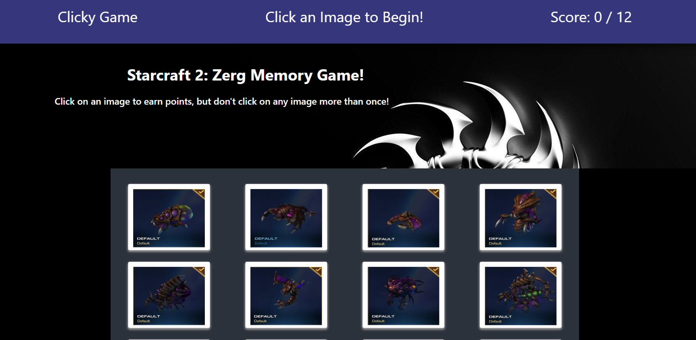

# Memory-Game

This is a memory game using React. The application's UI is split into four components.

Deployed: https://daneshrewsbury2288.github.io/Memory-Game/

## Getting Started

Create a new React application using Create React App.

The app should render 12 different images (of your choice) to the screen. Each image should listen for click events.

The app should keep track of the user's score. The user's score should be incremented when clicking an image for the first time. The user's score should be reset to 0 if they click the same image more than once.

Every time an image is clicked, the images rendered to the page should shuffle themselves in a random order.

Once the user's score is reset after an incorrect guess, the game should restart.

## Deployment

https://daneshrewsbury2288.github.io/Memory-Game/

## Built With

* React
* ES6
* Bootstrap
* CSS

## Authors

* **Dane Shrewsbury** - 2019
